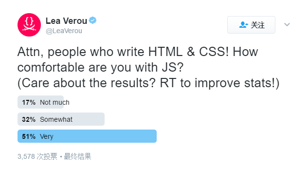

> https://www.smashingmagazine.com/2017/02/designing-html-apis/

作为JavaScript开发者，我们经常忘记不是每个人都有同样的知识。它被称为“知识的诅咒”：当我们成为某些方面的专家，会忘记作为初学者所遇到的困惑。我们对人们查找能力估计过高。因此，我们认为需要很多JavaScript来初始化或配置库我们写好了，同时我们的一些用户努力使用它们，疯狂地从文档里复制粘贴示例，胡乱调整它们直到起效果。

>  你也许想知道，“所有的HTML和CSS开发者都了解JavaScript的，对吧？”错。看看我的调查的结果，这是唯一我知道的数据。
>  
>
>  *调查：你使用JavaScript舒适性如何？*

编写HTML与CSS的人中每两位就有一人认为**与JavaScript一起写不舒服**。二分之一的比重，让他们先潜会水。

例如，看看下面初始化`jQuery UI`自动完成插件的代码，摘自于[这里](https://jqueryui.com/autocomplete/):

```HTML
<div class="ui-widget">
    <label for="tags">Tags: </label>
    <input id="tags">
</div>
```

```javascript
$( function() {
    var availableTags = [
        "ActionScript",
        "AppleScript",
        "Asp",
        "BASIC",
        "C"
    ];
    $( "#tags" ).autocomplete({
        source: availableTags
    });
} );
```

它很简单，甚至是对于不了解`JavaScript`的人，对吧？错。非程序员在看完文档中的例子时脑海会浮现各种各样的问题。“我应该把这些代码放在哪？”、“这些大括号，冒号和括号什么意思？”、“我需要他们吗？”，“如果我的元素没有`ID`怎么办？”等等。甚至这一小段代码需要人们理解对象字面量、数组、变量、字符串，如何获取一个`DOM`元素、事件的引用，什么时候`DOM`渲染完毕等等。这些对于程序员来说微不足道的事情，对于没有JavaScript知识的HTML开发者来说就是一场艰苦的战役。

现在考虑来自[HTML5](https://www.w3.org/TR/html5/forms.html#the-datalist-element)等价声明代码:

```html
<div class="ui-widget">
    <label for="tags">Tags: </label>
    <input id="tags" list="languages">
    <datalist id="languages">
        <option>ActionScript</option>
        <option>AppleScript</option>
        <option>Asp</option>
        <option>BASIC</option>
        <option>C</option>
    </datalist>
</div>
```


