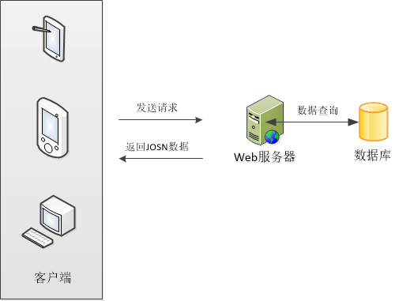

# 在线大规模定制平台需求分析

> 2017.1.10
>
> v1.0

## 概要

3D打印技术，被普遍认为是第三次工业革命重要标志，它如雨后春笋般的应用在工业制造、生物医疗等领域中。其在**教育应用**中亦起到了很大的作用。利用3D打印技术，亲历**从想象到图纸再到实物**的全过程。3D打印对于艺术表现形式与科学概念的表达是一种新颖的方式，特别有助于科技与艺术相结合的学习，即STEAM。

在线大规模定制平台（以下简称”平台“）是为用户提供3D打印服务而设计的平台。该平台可完成从设计至交易结束一系列流程。

## 工作流程

## 核心模块设计

暂有首页、商品列表页、商品详情页设计，由于图片太大，以附件方式发送。

##  技术选型

### 

服务器大概工作流程如上图所示。为方便**多端扩展**与**前后端分离**，后台仅需提供接口，返回`JSON`格式数据即可。在客户端将获取到的`JSON`数据按照模板渲染出来。各司其职，符合“**高内聚、低耦合**”软件开发风格。

### 服务器

#### 硬件部分

服务器建议使用`Windows 2008 Sever R2`或更高版本，`Linux`虽好，但熟悉是需要时间成本的。服务器作为项目重中之重，需要我们能够独立操控。建议选购阿里云服务器，省心省力。

#### 软件部分

后台作为整个项目的命脉，安全至上，其次再是稳定性等因素。目前主流后台语言`.net`、`php`，`Java`三分天下，业界主流使用`Java`开发后台，`php`开发前台。所以我建议使用`.net`或`Java`开发后台，<u>`.net`作为微软的产品，由于是闭源所以安全性有保障，微软会不定期发布更新。</u><u>`Java`作为`Oracle`公司的产品，历经几十年屹立不倒一定有他的优势。</u>（个人拙见）

#### 客户端部分

前台视情况而定，浏览器部分可以使用`Ajax`与后台通信，`APP`部分可以使用`HTTP`请求与后台通信。